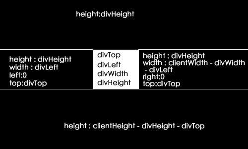

以前看优酷上有的影片会出现周围看不见的区域，只看见中间一块是显示的，然后呢一直想一直想，可不可能出现这种情况呢？

答案当然是肯定的了，我都上图了嘛

下面我来解说制作过程及以后可以应用到哪些场景

首先我们需要知道这些值：divWidth divHeight divTop divLeft
见下图：

然后给鼠标移动添加事件，并且update 这5个盒子的值即可
当然你看到的中间是圆形的，这个怎么做的，没办法只能用图片，不可能用代码（除了canvas）下可以画出这样的

图片的，所以只能用图片来替代圆形，而且建议用img别用background因为背景图片会在第一次开始事件时加载闪烁一下
[演示地址](/demo/taobao/)
进去后点击右键即可观看

那么这个效果可以用到哪里呢？还记得新手引导效果吗，懂行的人知道缩放窗口里面了就可能露馅，各种调试盒子的top left值，多么痛苦啊，现在有这个了，不用痛苦了多好的案例啊，全网首播！！！
