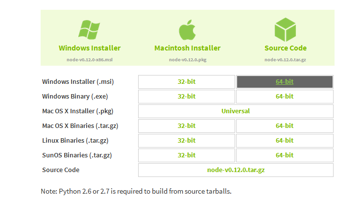
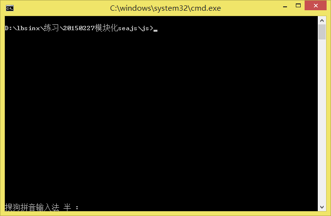
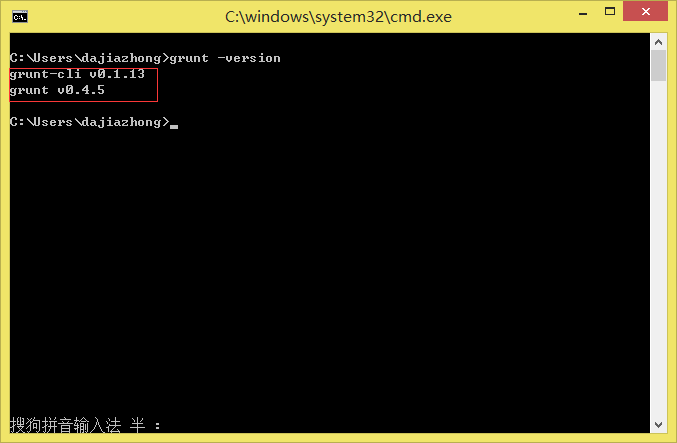
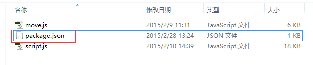
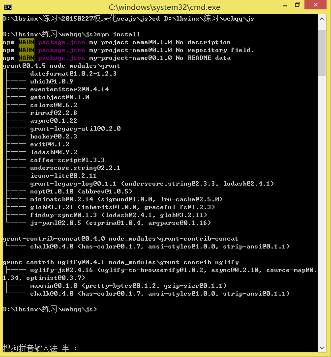
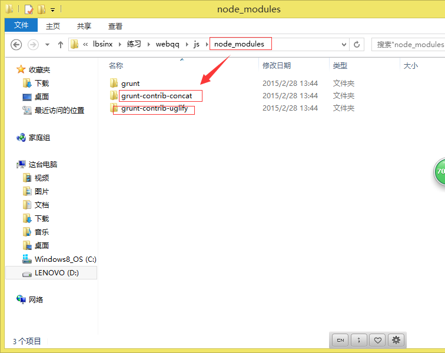
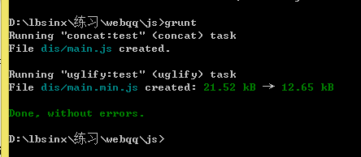
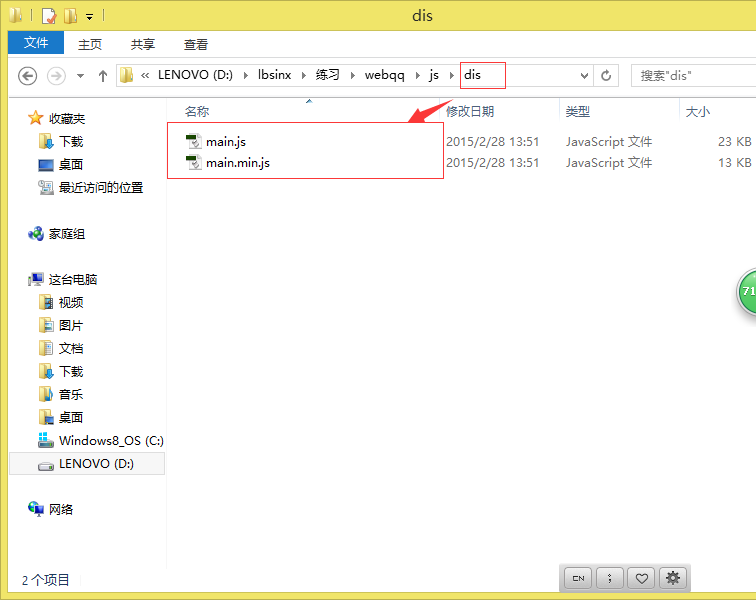
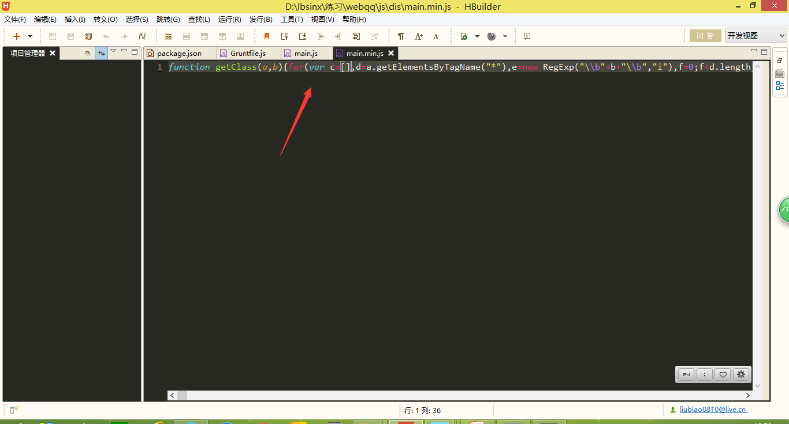

今天学习构建工具Grunt :www.gruntjs.org
构建工具拿来干嘛呢？常见可以这样的：

比如一个大的项目有许多开发者，最后要发布到线上了，相关的JS最好合并为一个JS文件，并且压缩最好了

呐！！，现在就可以用到grunt了，然而grunt是基于nodejs的，那么到底呀怎么安装使用呢？

首先我们去node官网 www.nodejs.org 下载支持自己电脑的版本

安装流程 ：

先安装nodejs和npm(包管理工具)
```shell
npm install -g grunt-cli

npm install grunt –save-dev

grunt –version
```



然后下一步下一步安装即可

然后打开命令行

`cmd`



一次输入下面命令，你可以选择复制进去即可
```sh
npm install -g grunt-cli

npm install grunt –save-dev

grunt -version
```
最后输入`grunt -version`这个时候显示


即证明安装成功, 接下来我们来用这个试试，

在要处理的文件的根目录下创建一个package.json文件


这个文件里面是
```json
{
  "name": "my-project-name",
  "version": "0.1.0",
  "devDependencies": {
    "grunt": "~0.4.5",
    "grunt-contrib-concat":"~0.4.0", // grunt官网找到的合并文件插件
    "grunt-contrib-uglify":"~0.4.0" // grunt官网找到的压缩文件插件
  }
}
```
然后在命令行中进入该项目合并文件的根目录（命令自己百度即可）

接下来就是下载插件到本地，在命令行中输入 npm install 等待下载

当出现这个

 

并且本地目录下存在这些



说明下载成功

那么现在我们可以开始合并压缩了

在合并文件的更目录创建Gruntfile.js

里面编写需要执行的命令，具体可以去官网相应插件查找文档
```js
module.exports = function(grunt) { 
    grunt.initConfig({
      pkg: grunt.file.readJSON('package.json'),
      concat: {
        test: {
            files: {
                'dis/main.js': ['move.js', 'script.js'] // 表示将"move.js","script.js"合并为main.js创建dis文件夹放置
            }
        }
      },
      uglify: {
        test: {
            files: {
                'dis/main.min.js': ['dis/main.js'] // 表示将dis/main.js压缩为main.min.js放置在dis文件夹中
            }
        }
      }
    });
    // 下面的事官网的示例代码拿出来的，相当于执行上面的配置
    grunt.loadNpmTasks('grunt-contrib-concat');
    grunt.loadNpmTasks('grunt-contrib-uglify');
    grunt.registerTask('default', ['concat', 'uglify']);
}
```
一切准备继续在命令行中输入grunt执行最后出现这个

即成功了，

我们看看本地文件

再看看代码：

是一行吧，说明操作成功

但有人问了，就这个啊，合并压缩，网上工具多的是，何必还命令行什么的多麻烦，

此言差矣我只是用这简单的例子说明grunt的强大而已
