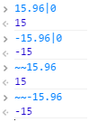
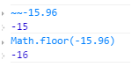
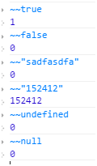
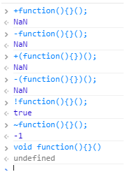
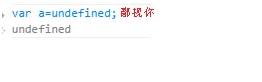
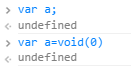
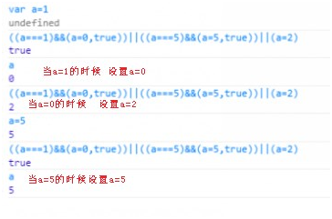
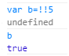
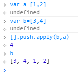
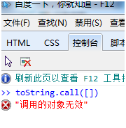

在 学习javascript的路上，偶尔会遇到那么几个看不懂的代码或者符号之类的就忍不住百度一下！搜嘎~ 原来如此！也许这就是装逼的一种效果吧！但是作为程序员也不想让别人一眼就看出你的代码！所以就有那么一批人开始了装逼之旅，但是能写出高逼格代码的人绝 对理解的比看不懂的要深刻~ 侬晓得吧！

推荐一下javascript装逼指南 这本书 很有益处哦！！！

下面列出一些装逼技巧 供像我这样菜鸟级的学生看一下：
> 技巧一：javascript高逼格之取整

也许你会想到Math的方法Math.ceil() 以及Math.floor()

但是你也许在别的代码中看到过这么两种符号 ~~ 和 |0

他们当然也是取整的了

没有这两样东西怎么能装的彻底嘞

特别注意的一点就是这两种方式是将小树后面的直接砍掉的当取负数的时候与Math.floor(-15.96)有所不同

下面多列举几个让大家明白


> 技巧二：javascript高逼格之匿名函数

一般情况下的匿名函数是这样的
```js
(function(){})();
```
但是还有其他的写法

当然，这样的写法，没有什么区别，纯粹看装逼程度。
这些可能只是一少部分，可能还有很多。我只是举例说明一下

我们知道这种是闭包的一种形式，

并且在编程中运算符（`+ – ~ ! `优先级相对其他的代码程序较高）

所以闭包前面加个运算符是木有关系的只是写法不同
> 技巧三：javascript高逼格之undefined

从来不需要声明一个变量的值是undefined，因为JavaScript会自动把一个未赋值的变量置为undefined。所有如果你在代码里这么写，会被鄙视的：

正常情况下：

顺便说下void

`void`在`JavaScript`中是一个操作符，对传入的操作不执行并且返回`undefined`。`void`后面可以跟()来用，例如 void(0)，看起来是不是很熟悉？没错，在HTML里阻止带href的默认点击操作时，都喜欢把href写成javascript:void(0)， 实际上也是依靠void操作不执行的意思。

> 技巧四：javascript高逼格之|| 和&&

||和&&是用来替换if else的

当你的代码中有很多else if 这样的条件逻辑判断，那么代码相当可怕

建议：先用if else 写 然后用 || 和 && 给代码瘦身
```js
if (a === 1) {
	a = 0;
} else if (a === 5) {
	a = 5;
} else {
	a = 2;
}
```

如上代码 利用||和&& 如何写呢

```js
((a === 1) && (a = 0, true)) || ((a === 5) && (a = 5, true)) || (a = 2)
```
> 技巧五：javascript高逼格之不加分号

关于JavaScript要不要加分号的争论已经吵了好几年。Google的JavaScript语法指南告诉我们要加分号，很多 JavaScript语法书籍也告诉我们加上分号更安全。然而，分号加不加，全靠个人对代码的写法，你确信写得足够安全的话，不加分号显得更加高大上。

在看jquery源码的时候记得还专门请教过大牛

Jq源码里面 有好多没有加分号的

我还发现一个规律：

但凡执行语句中的 } 前面的一句都没有最后的分号
> 技巧六：javascript高逼格之Function构造函数

很多JavaScript教程都告诉我们，不要直接用内置对象的构造函数来创建基本变量，例如var arr = new Array(2); 的写法就应该用var arr = [1, 2];的写法来取代。

但是，Function构造函数（注意是大写的Function）有点特别。Function构造函数接受的参数中，第一个是要传入的参数名，第二个是函数内的代码（用字符串来表示）。
```js
// 将会弹出窗口显示gudaochuan
var f = new Function('a', 'alert(a)');
f('gudaochuan');
```
这种方式可以根据传入字符串内容来创建一个函数 是不是高大上？！

最后给大家提供几种小的高逼格代码经验

!! '!'是取反操作，两个'!'自然是负负得正了。还是原来的值？其实他还有转化成boolean类型的作用


当你准备用`Object.prototype.toString.call()`的时候不妨用用`toString.call()`

当你准备用`[].contact()`的时候不妨用`[].push.apply()`



切忌 `toString.call() `在ie下不可用

ie下你装不起来

还得老老实实的写

当然还有很多高逼格的东西，我只是菜鸟如果后续用到的话一定会给大家做补充的！
