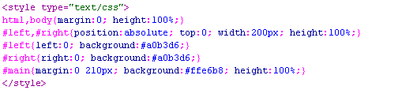

一、前言
在如今各个分辨率显示器N足鼎立的时期，页面采用流动性布局（亦可称自适应布局）不失为一个好选择。当然，具体实现不是那么容易，需要一定的css功力和 实践经验。本文不讲细节，只讲外部的自适应架构，这也是实现整个页面自适应的前提。目前为止，我所熟知的左中右三栏宽度自适应于浏览器的方法有三个：`绝对定位法`，`margin负值法`以及`自身浮动法`。这些方法简洁实用，且无兼容性问题。如果您想在您的页面上使用流动性布局，相信本文给您一些启示的。

二、三种方法
为了演示的需要，首先限定下示例的布局结构：左中右三栏布局，左右两栏宽度固定（要想不固定将宽度值改为百分值即可），中间栏宽度自适应。左右两栏的宽度为200像素。

> 1、绝对定位法

这或许是三种方法里最直观，最容易理解的：左右两栏采用绝对定位，分别固定于页面的左右两侧，中间的主体栏用左右margin值撑开距离。于是实现了三栏自适应布局。

您可以狠狠地点击这里：[绝对定位法演示demo](http://www.huar.love/demo/widthAuto/three-column-width-auto-1.html)
css代码如下（为截图）：

HTML代码为（图片）：

这里的左中右三个div的顺序是可以任意调整的，这与剩下的两中方法就不一样了，需要注意一下。

此方法的优点是，理解容易，上手简单，受内部元素影响而破坏布局的概率低，就是比较经得起折腾。
缺点在于：如果中间栏含有最小宽度限制，或是含有宽度的内部元素，当浏览器宽度小到一定程度，会发生层重叠的情况。然而，一般情况下，除非用户显示器分辨率宽度>=1600像素，否则用户不会把浏览器缩小到1000像素以下的，所以该缺陷危害指数3.
> 2、margin负值法
这种方法是在实际的网站中应用的最多的，我个人感觉多少有些跟风的嫌疑。此方法很难用一句话概括。首先，中间的主体要使用双层标签。外层div宽度 100%显示，并且浮动（本例左浮动，下面所述依次为基础），内层div为真正的主体内容，含有左右210像素的margin值。左栏与右栏都是采用 margin负值定位的，左栏左浮动，margin-left为-100%，由于前面的div宽度100%与浏览器，所以这里的-100%margin值 正好使左栏div定位到了页面的左侧；右侧栏也是左浮动，其margin-left也是负值，大小为其本身的宽度即200像素。

见下面的css代码：

HTML代码：

您可以狠狠地点击这里：[margin负值法演示demo](/demo/widthAuto/three-column-width-auto-2.html)
您需要注意几个div的顺序，无论是左浮动还是右浮动，先是主体部分div，这是肯定的，至于左右两栏谁先谁后，都无所谓，我测试了IE6，Firefox，以及chrome浏览器，表现一致。

此方法的优点：三栏相互关联，可谓真正意义上的自适应，有一定的抗性——布局不易受内部影响。
缺点在于：相对比较难理解些，上手不容易，代码相对复杂。出现百分比宽度，过多的负值定位，如果出现布局的bug，排查不易。
> 3、自身浮动法
此方法代码最简单。应用了标签浮动跟随的特性。左栏左浮动，右栏右浮动，主体直接放后面，就实现了自适应。

您可以狠狠地点击这里：[自身浮动法演示demo](http://www.huar.love/demo/widthAuto/three-column-width-auto-3.html)
css代码如下：

HTML代码：

这里三个div标签的顺序的关键是要把主体div放在最后，左右两栏div顺序任意。

此方法的优点是：代码足够简洁与高效
不足在于：中间主体存在克星，clear:both属性。如果要使用此方法，需避免明显的clear样式。

> 彩蛋：同理！兩欄佈局也一樣了
