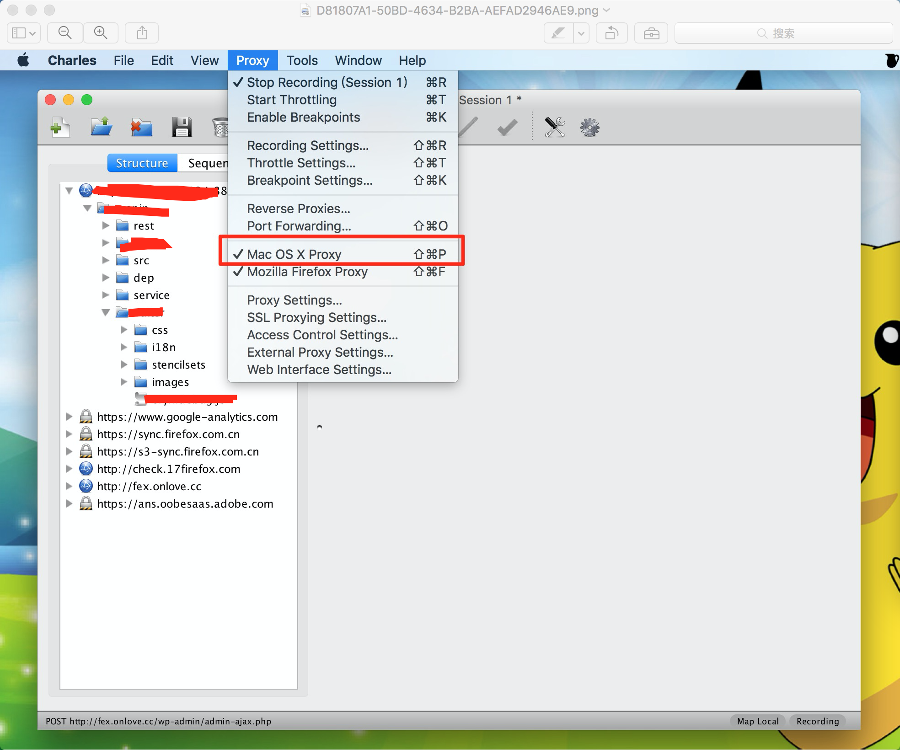

由于项目需求，会用到代理转发到本地代码，在这一过程中遇到很多坑，而且做一次很久后又会遇到，还会遗忘。所以写一篇文章记录下，方便以后查找；

先上图：

出现的问题：

1.代理始终转发不到本地；

2.还未发现，出现问题我再补充

解决步骤：

1,清除浏览器缓存；

2，将下图红色部分勾选上

3、确定步骤1，2都做好后，选择代理转发到本地的目录

最后刷新浏览器查看，代理成功，是不是很棒！！！

不要高兴得太早，有时候由于RD开发机的IP地址换了，又或者某种原因无论如何总是代理不成功。重复 了上万遍上述过程还是不成功。其实有个地方没太注意。

这个地方点击进去，出现不成功的可呢过是由于里面有相同的ip代理到了本地不同的地方，刚好成功那个是以前的而不是现在需要的。我这里已经清除了，演示不了了，大家自己去试。

解决方案，把这个冲突的清除即可，如果是在不知道哪个是多余的，就全部清除吧~~

