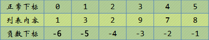
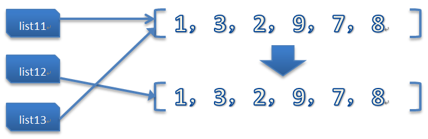

### 測試題

> 0.下边的列表分片操作会打印什么内容？

```python
list1 = [1, 3, 2, 9, 7, 8]
list1[2:5]
```

會打印：

`[2, 9, 7]`

> 1.请问 `list1[0]` 和 `list1[0:1]` 一样吗？

不一样，`list1[0]` 返回第0个元素的值，`list1[0:1]` 返回一个只含有第0个元素的列表。


`list1[0]` 是: `1`

`list1[0:1]` 是: `[1]`

> 2.如果你每次想从列表的末尾取出一个元素，并将这个元素插入到列表的最前边，你会怎么做？

`list1.insert(0, list1.pop())`

> 3.我想试试 `list1[-3:-1]` 会不会报错，怎么知道一试居然显示 `[9, 7]`，这是怎么回事呢？

Python 的列表很聪明，竟然支持负数索引，如图：



正常索引是从左到右索引，负数索引是从右到左。

> 4.在进行分片的时候，我们知道分片的开始和结束位置需要进行指定，但其实还有另外一个隐藏的设置：步长。

1) 之前提到的“简洁”分片操作在这里有效：

```python
list1[::2]
# [1, 2, 7]
```

2) 步长不能为0，要不就走不动了：

```python
list1[::0]
Traceback (most recent call last):
  File "<pyshell#11>", line 1, in <module>
    list1[::0]
ValueError: slice step cannot be zero
```

3) 步长可以是负数，改变方向（从尾部开始向左走）：

```python
list1[::-2]
# [8, 9, 3]
```

4) 步子太大容易扯着蛋......

只能取到第一位的數字

```python
lista[::999]
# [1]
```

> 5.教程中说可以利用分片完成列表的拷贝 `list2 = list1[:]`，那事实上可不可以直接写成 `list2 = list1` 更加简洁呢？

不可以，對於列表的拷貝，千萬不要這樣用，這樣相當於將新的名字也指向了同一個列表

```python
list1 = [1, 3, 2, 9, 7, 8]
list2 = list1[:]
list2
# [1, 3, 2, 9, 7, 8]
list3 = list1
list3
# [1, 3, 2, 9, 7, 8]
```
看上去貌似一样的，对吧？但事实上呢？我们利用列表的一个小伙伴做下修改，大家看一下差别：

```python
list1.sort()
list1
# [1, 2, 3, 7, 8, 9]
```
看到吧，我们的list1已经从小到大排了个序，那list2和list3呢？

```python
list2
# [1, 3, 2, 9, 7, 8]
```

可以看到我们使用分片的方式得到的list2很有原则、很有格调，并不会因为list1的改变而改变，这个原理我待会儿跟大家说，我们接着看下list3：

```python
list3
# [1, 2, 3, 7, 8, 9]
```

大家可以看到了，真正的汉奸、墙头草是list3，Ta跟着list1改变了，这是为什么呢？

教程中在讲解变量的时候说过，Python的变量就像一个标签，就一个名字而已，贴哪是哪，指哪打哪，來張教程中的圖。




