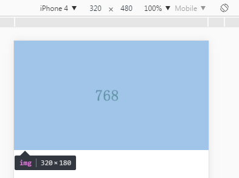
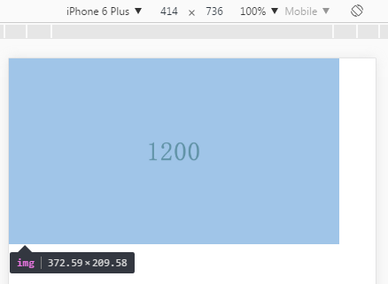
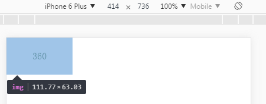
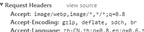
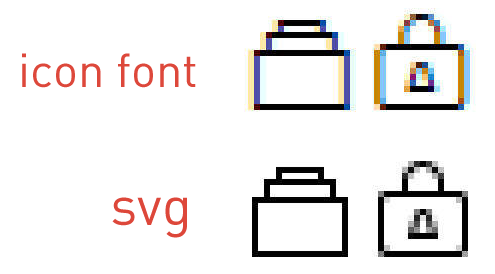
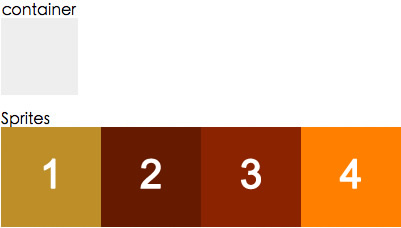
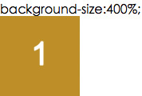
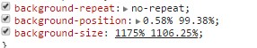

> 2017-06-05 星期一 丁酉年 五月十一

>【鸡年】丙午月 癸亥日

> 宜：畋猎 捕捉 结网 取渔 祭祀

> 忌：嫁娶 开市 安葬 启攒 行丧


響應式圖像，SVG的換色技巧，雪碧圖的百分比定位

本文介紹一些關於響應式圖像的適配應用策略，回退原理，`SVG`的換色技巧，雪碧圖的百分比定位計算公式等相關的一些小知識點，目的在於幫助一部分同學快速的理清圖像應用思路，以及一些web圖像的應用技巧。

### 1.響應式圖像的應用與回退

特點：應用簡單，上手容易，性能表現良好
難點：lazyload實現

根據不同設備，不同分辨率，不同像素比使用的響應式圖像，常用的有兩種場景：

#### 1.1固定尺寸圖像

基於設備像素比選擇，很多網站logo就是固定寬度圖像的一個例子，不管viewport的寬度如何，始終保持相同的寬度。

在dom里圖像與在css里的圖像寫法如下面的例子

```html

```

```css
background-image: image-set(url(test.jpg) 1x,url(test2.jpg) 2x);
```

#### 1.2不固定尺寸圖像

與內容相關的圖片，在需要響應式的時候，它們的大小往往並不是不變的，會隨viewport改變，對於這類圖像，也有兩種常用的處理方式

##### 1.2.1 我們使用srcset搭配w描述符以及sizes屬性 。

`w`描述符告訴瀏覽器列表中的每個圖象的質量。`sizes`屬性是一個包含兩個值的，由逗號分隔的列表。根據最新規範，如果`srcset`中任何圖像使用了w描述符，那麼必須要設置`sizes`屬性。

`sizes`屬性有兩個值：第一個是媒體條件；第二個是源圖尺寸值，在特定媒體條件下，此值決定了圖片的寬度。

比如：

```html

```

我們來逐條讀這一個img標籤的信息

srcset，我們給瀏覽器準備了四個質量的圖像，分別為360 768 1200 1920
sizes，我們來告訴瀏覽器，在不同的環境下圖像的寬度
當視口不大於360的時候，圖像顯示寬度為100vw，當視口不大於768的時候，圖像顯示寬度為90vw，以此類推。
最後一個src作為默認圖像url引入，並且是天然的回退方案，當瀏覽器不認識以上屬性的時候，直接讀取src渲染。

這樣說不夠直觀，我們看個demo



在iphone4（320）下，圖像寬度和我們設置的100vw一致，但是為什麼瀏覽器選擇了768的圖像而沒有選擇360的?因為4的dpr是2呀^_^，瀏覽器很智能的選擇了質量最合適的768.

再看一下6p（414），很聽話的按照我們的設置，顯示了90vw。因為他的dpr更高，瀏覽器聰明的選擇了1200質量的圖像。



這裡我們可以欺騙一下瀏覽器：

```
360.jpg 1200w,
1200.jpg 9999w
```

我們把360的圖像，騙瀏覽器說這是1200的，然後把原本1200的扔天上去



瀏覽器果然上當了，他把360的圖當成1200的來用了。這裡可能有些疑問，圖像的寬度為什麼不是90vw了哪？因為瀏覽器被騙了但是自己卻不知道，他依然按照1200的圖像，去適配dpr。414*90%*（360/1200）約等於111.7。這種方式很智能，瀏覽器去根據你的sizes，從w列表裡選擇最適合的圖像來調用顯示。正因為他太智能了，在實際操作中可控性較差，有些我們想精確控制的圖像顯示，有時候並不能如意。而且在做lazyload的時候要處理的東西也比較複雜。

這個時候可以考慮另外一種方式。

##### 1.2.2.picture元素，可精確把控

picture元素就像是圖像和其源的容器。瀏覽器仍然需要img元素，用來表明需要加載圖片，如果沒有img，那麼什麼都不會渲染。source為瀏覽器提供了要顯示圖像的供選版本。

適用場景為：在一個精確特定的轉效點（breakpoint）需要顯示一個特定的圖像時。使用picture元素選擇圖像，不會有歧義，理解起來也更直觀。

```html
<picture>
    <source media="(min-width: 960px)" srcset=960.jpg">
    <source media="(min-width: 768px)" srcset="768.jpg">
    
</picture>
```

在本例中，當viewport大於960像素時，會加載圖像960的圖像。當viewport寬度大於768像素時，瀏覽器會加載768的。而當寬度小於768像素時，加載默認圖像360。

而且這個寫法的懶加載非常好處理，只需要在傳統的`lazyload`策略上稍加改進

`data-src`
`data-srcset`
在加載到的時候更換為
`src`
`srcset`

就輕鬆解決了。

他也不需要去特意做回退處理，當瀏覽器不支持的時候就直接讀取img標籤。對於懶加載的回退......我選擇判斷IE 7-8...直接塞url給他.....。

### 2.特殊格式的圖像應用與回退

特點：體積優化效果顯著
難點：兼容性掌控

上面picture元素還可以提供 基於圖片格式選擇。

有一些圖像格式在較小的文件大小情況下保證了較好的圖片質量。聽起來還不錯，但殘酷的事實是沒有一個新格式被所有瀏覽器支持。谷歌的WebP表現不錯，但只有Chrome和Opera原聲支持。JPEG-XR，最初被稱為高清照片，是微軟發布的一個專有圖像格式，僅Internet Explorer支持

```html
<picture>
    <source type="image/vnd.ms-photo" src="test.jxr">
    <source type="image/jp2" src="test.jp2">
    <source type="image/webp" src="test.webp">
    
</picture>
```

source的type屬性用來指定每個圖像的MIME類型，瀏覽器會選擇第一個含有其支持的MIME類型的源。源的順序是至關重要的，如果瀏覽器無法識別所有的圖象類型，它會回退至原來的img元素。

但是目前這些格式的支持多數不會直接這麼做，因為代碼會有些冗餘難看，有判斷瀏覽器ua輸出不同dom或者樣式的，也有服務端直接輸出的。服務端直接輸出，或者CDN做特殊處理，進行無感知格式切換，同時預留url和拒絕的接口，處理起來更靈活，省時省力，例如我們的：



服務端根據瀏覽器的請求頭，返回不同的圖像格式，對於X5內核還可以支持sharpP。

### 3.SVG應用

難點：變色方案，響應式定位計算

上面這個source的type屬性還支持另一種我們更常用的圖像格式，SVG。

說起SVG，這是個出現頻率比webp更高的圖像格式了，他有着比iconfont更多的優點，所以現在web上正在大量的應用。

優點：

1.SVG提供的功能集涵蓋了嵌套轉換、裁剪路徑、Alpha通道、濾鏡效果等能力，它還具備了傳統圖片沒有的矢量功能，可適配任何高清屏。

2.可讀性好，有利於SEO與無障礙

與iconfont對比

1.渲染方式不同

無論黑白渲染，灰度渲染，次像素渲染，還是DirectWrite 或 GDI 渲染，既然iconfont他是一個字體，就難逃出現鋸齒的命運，特別是在一倍屏幕下的渲染。



2.icon font只能支持單色

icon font做為字體無法支持多色圖形，這就對設計造成了許多限制，因此這也成為了icon font的一個瓶頸。

3.icon font可讀性不好

icon font主要在頁面用Unicode符號調用對應的圖標，這種方式不管是瀏覽器，搜索引擎和對無障礙方面的能力都沒有SVG好

在對比完之前，可能有同學就會問，SVG和iconfont對比有個致命的缺點，就是換色.

比如hover換色，iconfont只要寫個顏色就好了，SVG是不是需要做兩個顏色的圖？這也是SVG圖像應用我們解決的一個難點之一

#### SVG換色，最初我試過三個方案

一是mask-image屬性，他的優點是簡單粗暴，直接用css來mask這個svg圖形來進行換色，缺點很明顯就是兼容性了，除去兼容性，還是很好用的。

demo：

```css
background: #ff6600;
-webkit-mask:center no-repeat;
-webkit-mask-image: url(qq-logo.svg);
```

二是通過SVG濾鏡來實現，優點是效果更好，缺點除了兼容性，還需要額外的腳本配合。關於濾鏡換色的詳細說明在我上一篇文章里有詳細介紹以及demo

三是我們最終選擇的底層無感知換色的方案，把修改顏色的腳本集成到了我們的工作流里，我們在寫css的時候，遇到svg需要換色的地方，只需要

```css
background-image: url(test.svg?fill=#ffffff)
```

加一句換色參數，工作流在底層會自動生成你所需要的svg圖片併合併到雪碧圖裡。

SVG應用的另一個難點，就是作為背景圖響應式渲染，雪碧圖的background-position和background-size 的計算，這個其實也是其他圖像都會存在的一個難點。

我的導師 wenju 之前發過這個計算公式相關的文章：

百分比值（）是背景圖相對於背景定位區（background positioning area）的百分比，可以控制在容器元素內僅顯示Sprites圖的部分內容。比如下圖中，Sprites圖是由四張圖像拼成的，要想在容器內僅顯示第一張圖像，background-size的值應該多少呢？



我們僅需要Sprites圖的1/4顯示在容器內，那麼Sprites圖與容器的比例應該是4:1，計算公式為： `background-size : ( Sprites width / image width) (Sprites height / image height)`



如何計算`background-position`

我們已知的信息如下：

容器元素的尺寸：`elW * elH`
單張圖片的尺寸：`imgW * imgH`
Sprites圖片的尺寸：`spritesW * spritesH`
單張圖片在Sprites圖上的位置：`imgPosX`, `imgPosY`

我們假設：

點的位置為 `(x, y)`
容器上的`(x, y)`點與容器左上角的距離為 `cX`, `cY`
`Sprites`圖上的`(x, y)`點與本張圖片左上角的距離為 `sX`, `sY`

如果要把某張圖片完全顯示在容器元素內，我們可以推導出：

`elW = imgW`, `elH = imgH`
`cX = sX`, `cY = sY`

根據上面的信息，我就可以計算出具體的`(x, y)`值了，下面以 `x%` 為例：

`cX = elW * x`
`sX = spritesW * x - imgPosX`
`elW * x = spritesW * x - imgPosX`

解方程後就得到計算公式了：

`x = imgPosX / (spritesW - elW) = imgPosX / (spritesW - imgW)`

`y = imgPosY / (spritesH - elH) = imgPosY / (spritesH - imgH)`

如果你每次都手動計算的話會被累死吧？所以這一步我們還是集成到了工作流里，在所有合併雪碧圖的地方用這個公式自動計算出位置。



而關於SVG的回退方案，已經是老生常談

比如

```html
<svg width="200" height="200">
    <image xlink:href="svg.svg" src="svg.png" width="200" height="200" />
</svg>
```

svg標籤方式，缺點必須指定寬高，沒有圖片的保持款高比例特性，優點兼容性好,兼容所有主流瀏覽器

或者

```html
<picture>
    <source type="image/svg+xml" srcset="svg.svg">
    
</picture>
```

在支持的瀏覽器里使用`SVG`，在不支持的瀏覽器里顯示`PNG`，優點是`type`靈活，可用於`SVG,WEBP`等，而且保持了`img`標籤的特性，方便做布局操作。缺點兼容性要求高，`ios9+`，`安卓5+`，`微軟Edge+`
當然這個兼容性說的是`source type`的兼容，並不是`SVG`本身的兼容。

對於`css`里的`SVG` 的應用與回退策略，比較簡單，也已經成熟，一般情況下都是這種用法

```css
background-image: url(fallback.png);
background-image: url(image.svg), none;
```

利用的技術是CSS3多背景，瀏覽器只要支持了多背景，幾乎無一例外支持SVG

再或者

```css
background-image: url(fallback.png);
background-image: image-set( "test.png" 1x, "test-2x.png" 2x, "test-print.png" 600dpi );
```

通過`image-set`來篩選和回退

原文转载至`腾讯isux`
