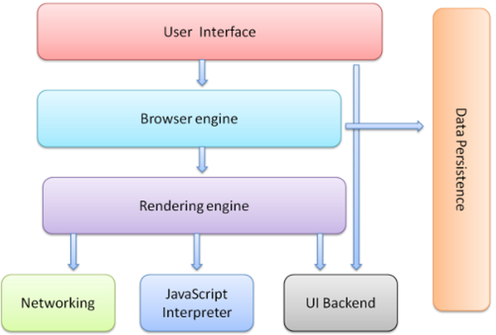
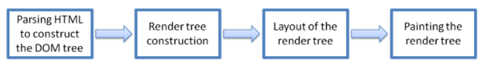
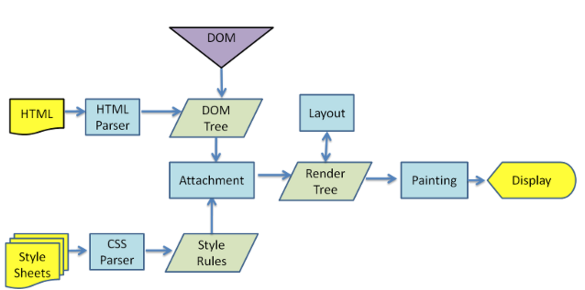
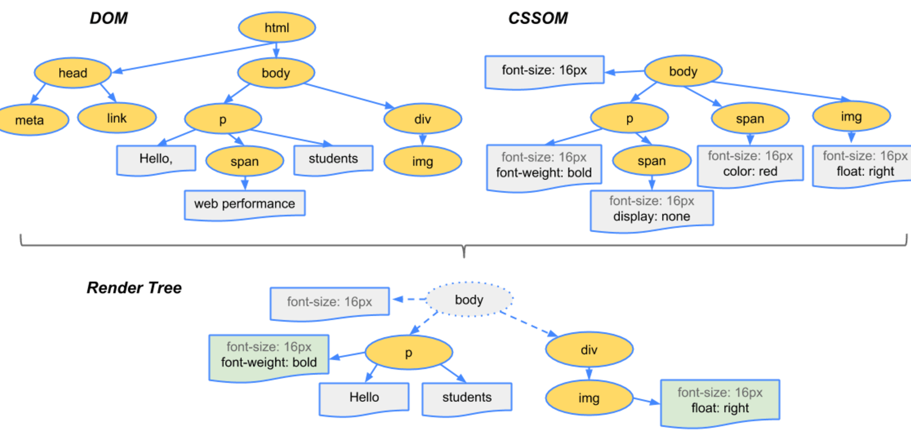

> 2017-06-13 星期二 丁酉年 五月十九

>【鸡年】丙午月 辛未日

> 宜：嫁娶 祭祀 祈福 求嗣 开光

> 忌：安葬 开生坟 合寿木 行丧

浏览器到底干了啥？chrome为例

用户接口：包括地址栏，前进后退，书签菜单等窗口上除了网页显示区域以外的部分。
浏览器引擎：查询与操作渲染引擎的接口。
渲染引擎：解析HTML和CSS并将结果显示到窗口。
网络：用于网络请求。
UI后端：绘制基础元件，如组合框与窗口。
JavaScript解释器：解释执行js。
数据存储：把需要的数据写到硬盘，持久层。H5规定了web 。database

chrome使用多个渲染引擎实例，每个Tab一个，每个Tab都是一个独立进程。

### 渲染机制

主要:

构建`DOM`和`CSSOM`：`（Bytes → characters → tokens → nodes → object model）`

构建`render tree`：（非可视化和`display:none`的`DOM`元素不会出现在渲染树中）

`render tree`布局

`render tree`绘制

`Reflow`:重新计算样式和渲染树

`Repaint`:采用新样式绘制元素

webkit为例:

详细过程:

1.Create/Update DOM And request css/image/js

> 浏览器请求到HTML后，开始解析HTML，生成DOM，同时会并行发起对资源文件的请求（可能存在某种匹配机制）

2.Create/Update Render CSSOM
​    
> CSS文件下载完后开始构建CSSOM

3.Create/Update Render Tree

> CSSOM生成以后与DOM一起生成Render Tree

4.Layout/Reflow

> 根据渲染树计算各个节点的位置，完成布局

5.Painting/Repaint

> 按照布局完成页面绘制

tips

> DomContentLoad和load事件触发时间不同，前者是DOM构建完毕，后者在所有资源下载完以后触发。

Q&A

    Q: 页面渲染出来了指的是什么？
    A: 无图片首屏，有图片首屏，完整加载。
    Q: script标签对首屏影响？
    A: 如果script不在首屏范围内，不影响首屏时间，但有可能截断首屏的内容。
    Q: script放body底部以及async、defer属性的好处？
    A: 放底部可以防止首屏内容被截断；浏览器并行下载资源有限制，为减少tcp占用，使用async或defer。defer是在页面加载完后执行这部分js，async则是异步执行，不阻塞页面任务。

