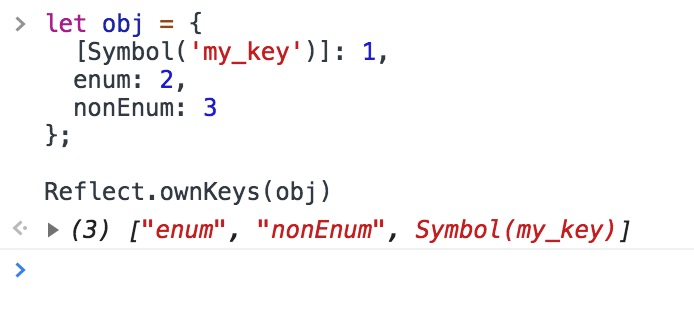

### `Reflect.ownKeys` 返回所有类型的键名，包括常规键名和`Symbol`键名

```js
let obj = {
  [Symbol('my_key')]: 1,
  enum: 2,
  nonEnum: 3
};
Reflect.ownKeys(obj)
//  ['enum', 'nonEnum', Symbol(my_key)]
```

### ES6 新增内置对象的Symbol.toStringTag属性值如下

```js
JSON[Symbol.toStringTag]：'JSON'
Math[Symbol.toStringTag]：'Math'
Module 对象M[Symbol.toStringTag]：'Module'
ArrayBuffer.prototype[Symbol.toStringTag]：'ArrayBuffer'
DataView.prototype[Symbol.toStringTag]：'DataView'
Map.prototype[Symbol.toStringTag]：'Map'
Promise.prototype[Symbol.toStringTag]：'Promise'
Set.prototype[Symbol.toStringTag]：'Set'
%TypedArray%.prototype[Symbol.toStringTag]：'Uint8Array'等
WeakMap.prototype[Symbol.toStringTag]：'WeakMap'
WeakSet.prototype[Symbol.toStringTag]：'WeakSet'
%MapIteratorPrototype%[Symbol.toStringTag]：'Map Iterator'
%SetIteratorPrototype%[Symbol.toStringTag]：'Set Iterator'
%StringIteratorPrototype%[Symbol.toStringTag]：'String Iterator'
Symbol.prototype[Symbol.toStringTag]：'Symbol'
Generator.prototype[Symbol.toStringTag]：'Generator'
GeneratorFunction.prototype[Symbol.toStringTag]：'GeneratorFunction'
```
### Set

ES6 提供了新的数据结构 Set。它类似于数组，但是成员的值都是唯一的，没有重复的值。

Set 本身是一个构造函数，用来生成 Set 数据结构。

```js
const s = new Set();

[2, 3, 5, 4, 5, 2, 2].forEach(x => s.add(x));

for (let i of s) {
  console.log(i);
}
// 2 3 5 4
```
所以这个可以用来简单去重，也不失为一种好的方法 
`// 去除数组的重复成员[...new Set(array)]`

Set 实例的方法分为两大类：操作方法（用于操作数据）和遍历方法（用于遍历成员）。下面先介绍四个操作方法。

`add(value)`：添加某个值，返回 Set 结构本身。
`delete(value)`：删除某个值，返回一个布尔值，表示删除是否成功。
`has(value)`：返回一个布尔值，表示该值是否为Set的成员。
`clear()`：清除所有成员，没有返回值。
