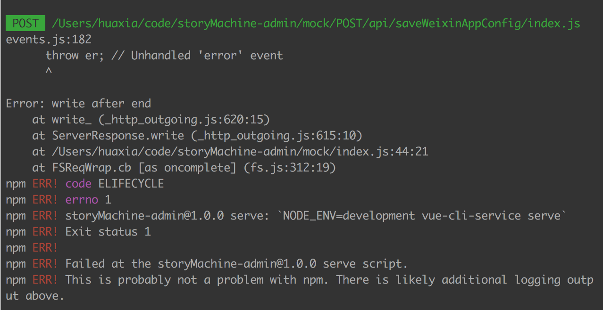
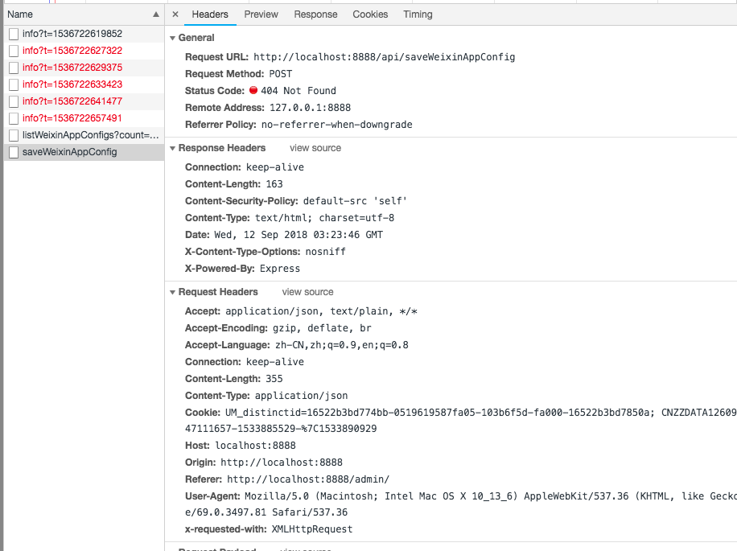
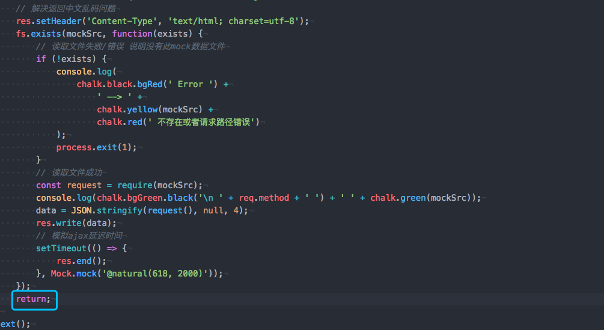
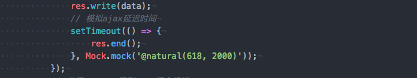

#### 1.  🎬 前情提要

😭 某天在本地开发`vue`项目时需要本地mock,一直使用get获取数据，未出现任何毛病，结果在做提交数据`POST`请求时就一直404断掉nodejs服务器

#### 2. 🐒 现象展示

#### 3. 🏁 开始寻求解决方案

[ x ] 排查是否是本地读取文件错误

[ x ] 排查是否是`axios`插件错误

[ x ] 排查是否是`response` 直接未返回数据错误

#### 4. 😀 后来查找到原因

> 是因为在 `res.end` 后不能再有 `res.write`  

but！😯！并没有  `res.end` 后再次  `res.write`  啊？为什么会酱紫？😯？一脸蒙圈~~

------

原来是`post`请求会在握手🤝请求成功后再次进入`next()` 导致这样的原因，所以应该在其后面`return`掉即可解决这一问题