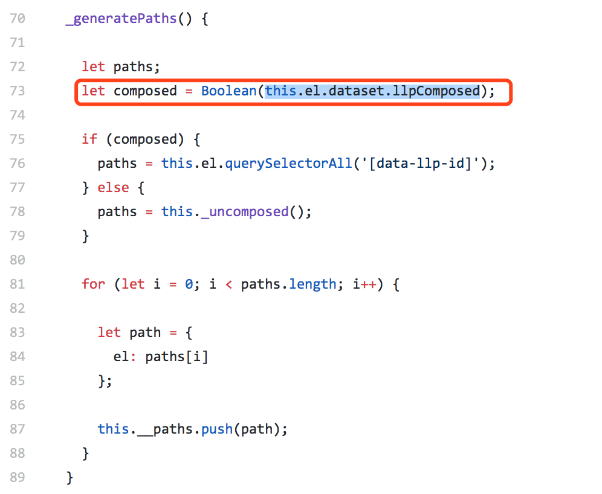
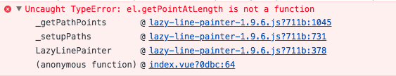
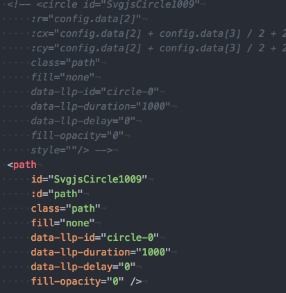
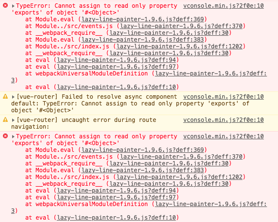
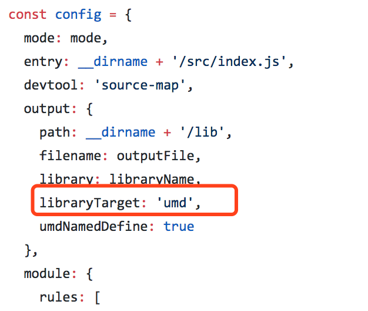

### 💋 前情提要

在Android4.4.4版本的机器上做需求？且是用vue然后使用客户端同学集成的webview加载进去，所有和的复杂的逻辑都给了js操作(一万句草泥马奔腾而过)。各种TTS、video、audio、xxx、xxx(不能暴露的xxx)兼容，客户端还不管！这又不是前端改解决的，结果人家来句，你们加个东西也可以解决啊？切~~好啊，hack就hack了，你开心就好。所以出以下兼容性问题，这个问题理应前端解决的，没毛病的。但是用前端做这一套，确定交互体验会好，还是视频课程等等复杂交互哦。那么来看看什么问题呢？

### 🧐 界面上要画一些圈、线、箭头来做指示用

1. 不能使用图片
2. 能随意变换大小、长度、颜色等
3. 兼容这个版本的安卓

so !  css3不能用，图片不能用，canvas不能用，只能前端做在webview层，不能客户端做了调用，那么我来试试svg吧。

### 🤪 先来看看效果吧

> 对没有，还要求做成动画，对于不熟悉svg的我来说，看上去有点复杂，怎么办，一步一步查资料解决呗
>
> 经过各种折腾终于把没有动画的做出来了，接下来就是把动画加上

### 🤓 找到一个插件，看上去还可以

[lazy-line-painter](https://github.com/camoconnell/lazy-line-painter) 

接下来就是撸起袖子怼上去，期间还解决了和vue的配合使用问题，问题不大，最后还是解决了，不过有点使用不是很合理

### 👽 还没有完呢，你以为解决问题，万事大吉了？

哇擦，出现兼容问题了

#### 🐛 ele.dataset  在低版本浏览器找不到

先是报了一个错误:  `this.el.dataset.llpComposed` undefined，也就是截图一行报错

开始以为是 `llpComposed`报错，后来想想，不对应该是连`dataset`都没有，所以查了下，果然是低版本浏览器不支持这个，所以瞬间想到使用 `ele.attributes` 代替，干活，拉取原作者仓库，开动，搞定 ——> [github](https://github.com/huarxia/lazy-line-painter) 

### 🐛 lazy-line-painter-1.9.6.js?711b:1045Uncaught TypeError: el.getPointAtLength is not a function

what? 低版本又不兼容？

> 查了下原因，`getPointAtLength`该方法只支持对`path`操作，不支持svg的基本图形 `rect` `circle` `line` `polyline` 

哪能怎么办转换呗，举个栗子🌰

> 👶 到此lazylinepainterSVG插件的低版本浏览器兼容问题已解决

接下来就是将兼容版本集成到项目里，咔嚓

这是什么鬼？原来是`lazylinepainter` 中webpack  build 中 `module.exports` 不能和 `import`混用导致的？但是我都是按照他的写法写的啊，一点毛病没有，我也不会到为什么，最后改他的webpack配置: `libraryTarget: 'umd'` 才解决，改成一种，然后又改回来重新buidl就解决了，我也不知道为嘛？！！

#### 到此，所有问题才算真正解决了，可以动态svg了，真的是让前端在安卓上做复杂交互的应用就是个坑啊，我说的复杂不是一般的复杂交互，是特别特别复杂那种，视频里的操作，音频操作，流程控制等等，还压缩时间~~~😨😨😨